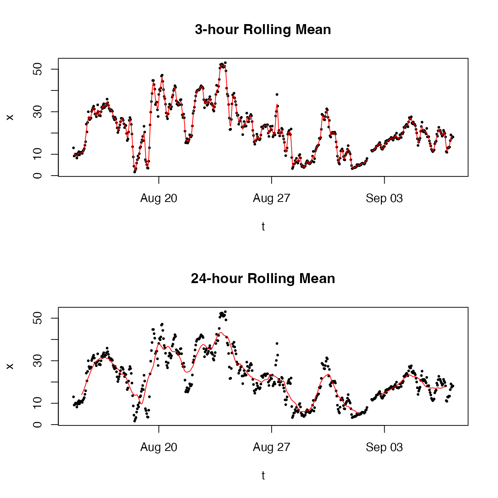
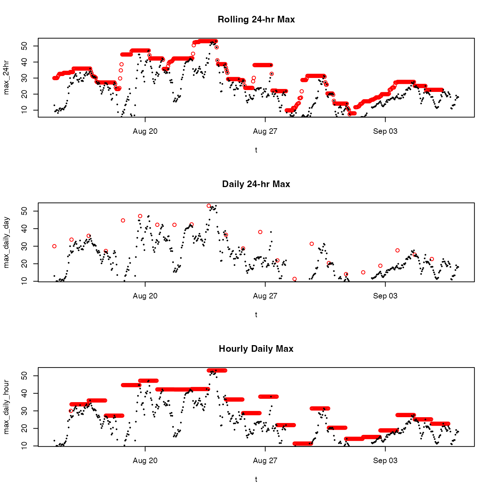
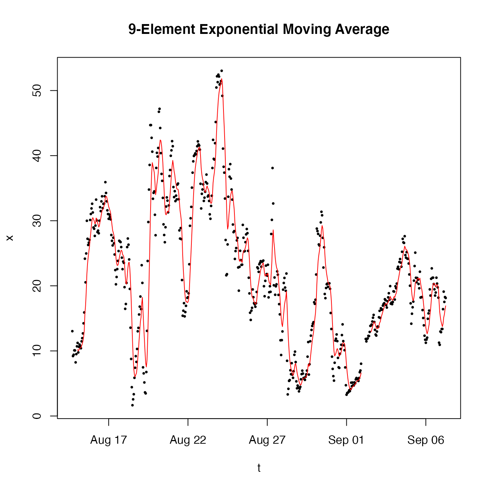

# Introduction to MazamaRollUtils

## Background

Time series analysis often uses rolling calculations such as moving
averages. These functions are straightforward to write in any language
and it makes sense to have C++ versions of common rolling functions
available to R as they dramatically speed up calculations. Several
packages exist that provide some version of this functionality:

- [zoo](https://cran.r-project.org/package=zoo) – widely used package
  for ordered observations and rolling calculations
- [seismicRoll](https://cran.r-project.org/package=seismicRoll) –
  rolling functions focused on seismology
- [RcppRoll](https://cran.r-project.org/package=RcppRoll) – rolling
  functions for basic statistics

Our goal in creating a new package of C++ rolling functions is to build
up a suite of functions useful in environmental time series analysis. We
want these functions to be available in a neutral environment with no
underlying data model. The functions are as straightforward to use as is
reasonably possible with a target audience of data analysts at any level
of R expertise.

## Installation

Install from CRAN with:

    install.packages('MazamaRollUtils')

Install the latest version from GitHub with:

    remotes::install_github("MazamaScience/MazamaRollUtils")

## Features

### Predictable Names

Many of the rolling functions in **MazamaRollUtils** have the names of
familiar **R** functions with `roll_` prepended. These functions
calculate rolling versions of the expected statistic:

- [`roll_max()`](../reference/roll_max.md)
- [`roll_mean()`](../reference/roll_mean.md)
- [`roll_median()`](../reference/roll_median.md)
- [`roll_min()`](../reference/roll_min.md)
- [`roll_prod()`](../reference/roll_prod.md)
- [`roll_sd()`](../reference/roll_sd.md)
- [`roll_sum()`](../reference/roll_sum.md)
- [`roll_var()`](../reference/roll_var.md)

Additional rolling functions with no equivalent in base R include:

- [`roll_MAD()`](../reference/roll_MAD.md) – Median Absolute Deviation
- [`roll_hampel()`](../reference/roll_hampel.md) – Hampel filter
- [`roll_nowcast()`](../reference/roll_nowcast.md) – US EPA NowCast

Other functions wrap the rolling functions to provide enhanced
functionality. These are not required to return vectors of the same
length as the input data.

- [`findOutliers()`](../reference/findOutliers.md) – returns indices of
  outlier values identified by
  [`roll_hampel()`](../reference/roll_hampel.md).

### Common Arguments

All of the `roll_~()` functions accept the same arguments where
appropriate:

- `x` – Numeric vector input.
- `width` – Integer width of the rolling window.
- `by` – Integer shift to use when sliding the window to the next
  location
- `align` – Character position of the return value within the window.
  One of: `"left" | "center" | "right"`.
- `na.rm` – Logical specifying whether `NA` values should be removed
  before the calculations within each window.

The [`roll_mean()`](../reference/roll_mean.md) function also accepts:

- `weights` – Numeric vector of size `width` specifying each window
  index weight. If `NULL`, unit weights are used.

For statistical clarity, [`roll_sd()`](../reference/roll_sd.md) and
[`roll_var()`](../reference/roll_var.md) do not provide a `na.rm`
argument.

The [`roll_nowcast()`](../reference/roll_nowcast.md) function only
accepts the `x` argument and is defined as having:

- `width = 12`
- `by = 1`
- `align = "right"`
- `na.rm = TRUE`

### Predictable Return Length

The output of each `roll_~()` function is guaranteed to have the same
length as the input vector, with varying stretches of `NA` at one or
both ends depending on arguments `width`, `align` and `na.rm`. This
makes it easy to align the return values with the input data.

## Examples

The example dataset included in the package contains a tiny amount of
data but suffices to demonstrate usage of package functions.

### Basic Rolling Means

``` r
library(MazamaRollUtils)

# Extract vectors from our example dataset
t <- example_pm25$datetime
x <- example_pm25$pm25

# Plot with 3- and 24-hr rolling means
layout(matrix(seq(2)))
plot(t, x, pch = 16, cex = 0.5)
lines(t, roll_mean(x, width = 3), col = 'red')
title("3-hour Rolling Mean")
plot(t, x, pch = 16, cex = 0.5)
lines(t, roll_mean(x, width = 24), col = 'red')
title("24-hour Rolling Mean")
```



``` r
layout(1)
```

### Using ‘width’, ‘align’, ‘by’ and ‘na.rm’

The next example uses all of the standard arguments to quickly calculate
a daily maximum value and spread it out across all indices.

``` r
library(MazamaRollUtils)

# Extract vectors from our example dataset
t <- example_pm25$datetime
x <- example_pm25$pm25

# Calculate the left-aligned 24-hr max every hour, ignoring NA values
max_24hr <- roll_max(x, width = 24, align = "left", by = 1, na.rm = TRUE)

# Calculate the left-aligned daily max once every 24 hours, ignoring NA values
max_daily_day <- roll_max(x, width = 24, align = "left", by = 24, na.rm = TRUE)

# Spread the max_daily_day value out to every hour with a right-aligned look "back"
max_daily_hour <- roll_max(max_daily_day, width = 24, align = "right", by = 1, na.rm = TRUE)

# Plot with 3- and 24-hr rolling means
layout(matrix(seq(3)))
plot(t, max_24hr, col = 'red')
points(t, x, pch = 16, cex = 0.5)
title("Rolling 24-hr Max")
plot(t, max_daily_day, col = 'red')
points(t, x, pch = 16, cex = 0.5)
title("Daily 24-hr Max")
plot(t, max_daily_hour, col = 'red')
points(t, x, pch = 16, cex = 0.5)
title("Hourly Daily Max")
```



``` r
layout(1)
```

### Using roll_mean() with ‘weights’

The [`roll_mean()`](../reference/roll_mean.md) function accepts a
`weights` argument that can be used to create a *weighted moving
average*. The next example demonstrates creation of an exponential
weighting function to be applied to our data.

``` r
library(MazamaRollUtils)

# Extract vectors from our example dataset
t <- example_pm25$datetime
x <- example_pm25$pm25

# Create weights for a 9-element exponentially weighted window
#   See:  https://en.wikipedia.org/wiki/Moving_average
N <- 9
alpha <- 2/(N + 1)
w <- (1-alpha)^(0:(N-1))
weights <- rev(w)          # right aligned window

EMA <- roll_mean(x, width = N, align = "right", weights = weights)

# Plot Exponential Moving Average (EMA)
plot(t, x, pch = 16, cex = 0.5)
lines(t, EMA, col = 'red')
title("9-Element Exponential Moving Average")
```


